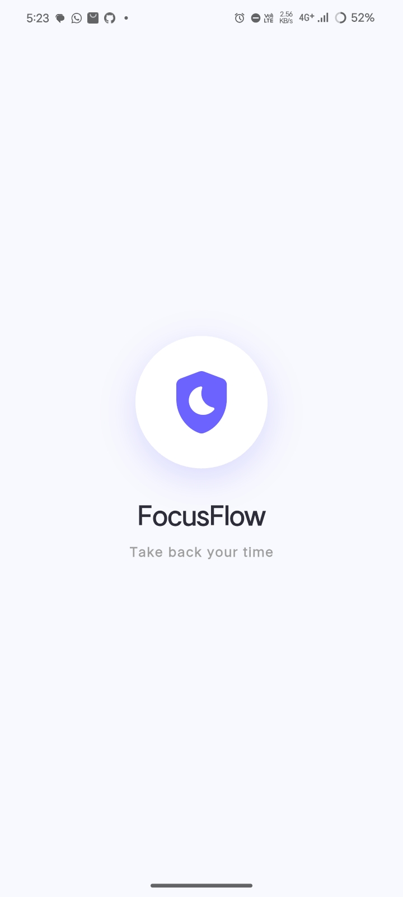
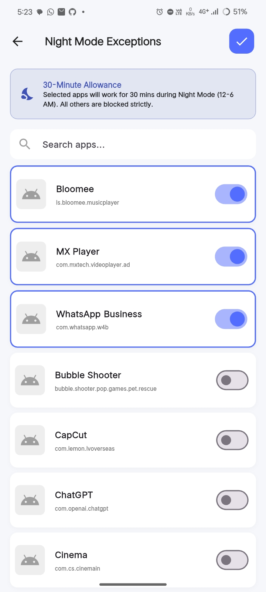
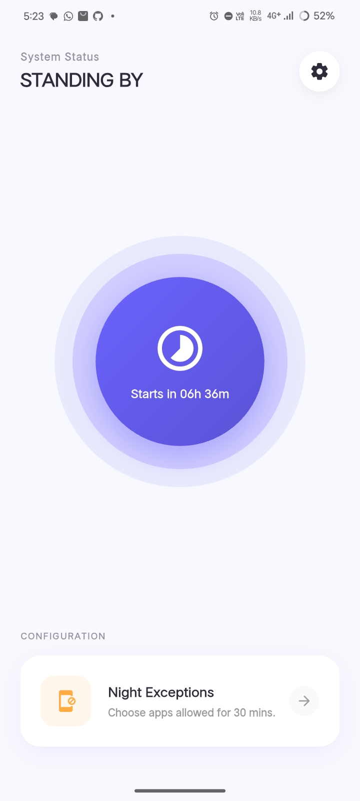

# FocusFlow 🛡️

[](https://flutter.dev)
[](https://dart.dev)
[](https://opensource.org/licenses/MIT)
[](https://m3.material.io)

**FocusFlow** is a modern productivity application designed to help you regain control of your time. By intelligently managing distracting apps, especially during critical rest hours, FocusFlow acts as your digital guardian.

---

## 📖 Table of Contents
- [✨ Features](#-features)
- [📱 Screenshots](#-screenshots)
- [🚀 Getting Started](#-getting-started)
  - [Prerequisites](#prerequisites)
  - [Installation](#installation)
- [🛠 Usage](#-usage)
- [🏗 Architecture](#-architecture)
- [📂 Project Structure](#-project-structure)
- [🤝 Contributing](#-contributing)
- [📄 License](#-license)

---

## ✨ Features

| Feature | Description |
| :--- | :--- |
| **🌙 Night Guard** | Automatically blocks distracting apps between **12:00 AM and 6:00 AM** to ensure restful sleep. |
| **🛡️ App Blocking** | Uses Accessibility Services to instantly detect and close unauthorized apps. |
| **⏳ Exception Handling** | Flexible "Night Exceptions" allow you to whitelist specific apps for 30-minute intervals. |
| **🎨 Modern UI** | Built with **Material 3**, featuring smooth animations (pulse, slide) and a clean, distraction-free aesthetic. |
| **🔒 Privacy First** | All data stays on your device. No external servers or data tracking. |

---

## 📱 Screenshots

| Splash Screen | Permission Setup | Dashboard | Setting |
| :---: | :---: | :---: | :---: |
|  |  |  |  |

> *Note: Placeholders for screenshots. Run the app to see the beautiful UI in action!*

---

## 🚀 Getting Started

<details>
<summary><strong>Click to expand Prerequisites</strong></summary>

- **Flutter SDK**: Version 3.0 or higher.
- **Dart SDK**: Version 3.0 or higher.
- **Android Device/Emulator**: API Level 21+ (Required for Accessibility Services).
- **VS Code / Android Studio**: With Flutter extensions installed.

</details>

### Installation

1.  **Clone the repository:**
    ```bash
    git clone https://github.com/yourusername/focusflow.git
    cd focusflow
    ```

2.  **Install dependencies:**
    ```bash
    flutter pub get
    ```

3.  **Run the app:**
    ```bash
    flutter run
    ```

---

## 🛠 Usage

1.  **Launch the App**: You will be greeted by the Splash Screen.
2.  **Grant Permissions**:
    *   **Notifications**: To receive alerts about blocking status.
    *   **Accessibility**: Crucial for the app blocking mechanism to work. The app will guide you to the system settings.
3.  **Dashboard**:
    *   Check the **System Status** (STANDING BY vs NIGHT GUARD).
    *   View the countdown to the next Night Mode session.
4.  **Exceptions**:
    *   Tap "Night Exceptions" to select apps that are allowed during the restricted hours.

---

## 🏗 Architecture

FocusFlow follows a clean and responsive architecture using **StatefulWidgets** for local state management and **AnimationControllers** for engaging visual feedback.

*   **`lib/main.dart`**: Entry point, sets up the Theme and System UI overlay styles.
*   **`lib/screens/`**: Contains all UI screens.
    *   [`splash_screen.dart`](lib/screens/splash_screen.dart): Initializes the app and navigates to permissions.
    *   [`permission_screen.dart`](lib/screens/permission_screen.dart): Handles critical permission requests (Notification, Accessibility).
    *   [`dashboard_screen.dart`](lib/screens/dashboard_screen.dart): The main hub. Displays status, animations, and access to settings.
    *   [`app_picker_screen.dart`](lib/screens/app_picker_screen.dart): Manage whitelisted applications.

---

## 📂 Project Structure

<details>
<summary><strong>View Directory Tree</strong></summary>

```
.
├── android/                 # Android native code
├── assets/                  # Images and icons
├── lib/
│   ├── screens/
│   │   ├── app_picker_screen.dart
│   │   ├── dashboard_screen.dart
│   │   ├── permission_screen.dart
│   │   ├── settings_screen.dart
│   │   └── splash_screen.dart
│   └── main.dart            # Application entry point
├── web/                     # Web configuration
├── pubspec.yaml             # Dependencies
└── README.md                # Project documentation
```

</details>

---

## 🤝 Contributing

Contributions are welcome! If you'd like to improve the UI, add new blocking features, or optimize performance:

1.  Fork the repository.
2.  Create your feature branch (`git checkout -b feature/AmazingFeature`).
3.  Commit your changes (`git commit -m 'Add some AmazingFeature'`).
4.  Push to the branch (`git push origin feature/AmazingFeature`).
5.  Open a Pull Request.

---

## 📄 License

This project is licensed under the MIT License - see the LICENSE file for details.
